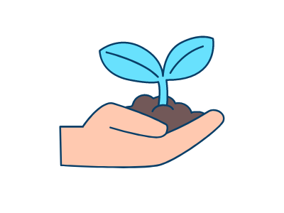

L'association MTG France (Microsoft Tech Group France) est une association à but non-lucratif dont l'objectif et de rassembler et animer les différentes communautés locales autour des technologies informatique, et en particulier autour de l'écosystème Microsoft.

<h2 class="text-center">A quoi sert MTG:France ?</h2>

<section class="text-center">

<h4>Regrouper les communauté</h4>

Nous rassemblons les différentes communautés pour leur permettre d'échanger entre elles, de mutualiser leurs compétences et leur réseau de connaissances.
<!--
Nous organisons des évènements entre les organisateurs de communautés pour leur permettre de se rencontrer.
Nous mutualisons les éventuels achats de matériel promotionel.
-->

<h4>Mutualiser les moyens</h4>

Nous nous chargeons d'obtenir des sponsors, et faisons profiter nos adhérents de ces ressources pour leurs propres projets.
<!--
Nous offrons des licences et des moyens pour diffuser vos vidéos dans le cas d'évènements live.
Nous échangeons avec Microsoft et d'autres partenaires pour aider à la venue de speakers pour animer vos évènements.
-->

<h4>Assurer l'indépendance</h4>

MTG France ne souhaite pas se substituer aux communautés.
Son objectif est uniquement d'amplifier leur portée et de les aider à se développer.

<h4>Améliorer la visibilité</h4>

Au travers de la marque MTG, les communautés qui le souhaitent peuvent bénéficier d'une marque commune, reconnue, et de ses ressources associées (visuels, logos, etc.).
<!--
Nous fournissons tout un ensemble de ressources (clip vidéos, logos, stickers, assets graphiques) et sommes en contact direct privilégié avec Microsoft.
L'adoption de la marque MTG est optionnelle : les communautés adhérentes peuvent conserver leur propre identité et simplement rejoindre l'association MTG France.
Elles pourront bénéficier des ressources partagées en tant que membre de l'association.
-->

<h4>Aider à démarrer</h4>

Nous acueillons les initiatives locales de création de communautés pour leur fournir conseils et ressources.

</section>